# springboot080房屋租赁管理系统 / springboot080-House_Rental_Management_System


> 更多毕设项目可跳转至项目导航栏检索：[毕设项目](http://sysadmin.3vfree.vip)，需要联系博主v：xq-lucky311，q：1047944234. 备注：项目咨询注：由于前端项目太大，仅上传了后端代码，未包含前端代码...

## 项目简介  
基于SpringBoot+MyBatis Plus的房屋租赁管理系统，采用MySQL存储数据，实现管理员、屋主和用户三端协同管理。系统包含房屋管理、订单处理、保洁安保预约等核心功能，满足租赁全流程数字化管理需求。

## 特征介绍  
- **权限控制**：集成Shiro实现角色权限分离，支持管理员/屋主/用户三级权限体系。  
- **高效开发**：MyBatis Plus零SQL实现CRUD操作，内置代码生成器提升开发效率。  
- **文件管理**：集成commons-io实现文件上传功能，支持房屋图片云端存储。  
- **工具集成**：整合Hutool工具包提供加密(MD5Util)、HTTP请求(HttpClientUtils)等通用能力。  
- **模块化架构**：严格分层设计(controller/service/entity/dao)，支持业务功能扩展。  

## 代码结构
```
src/
├── main/
│   ├── java/
│   │   ├── com/
│   │   │   ├── annotation/          # 权限注解
│   │   │   │   ├── IgnoreAuth.java
│   │   │   │   ├── LoginUser.java
│   │   │   ├── config/              # 全局配置
│   │   │   │   ├── InterceptorConfig.java
│   │   │   │   ├── MybatisPlusConfig.java
│   │   │   ├── controller/          # 接口层
│   │   │   │   ├── AnbaoguanliController.java
│   │   │   │   ├── BaojieguanliController.java
│   │   │   ├── dao/                 # 数据访问层
│   │   │   │   ├── AnbaoguanliDao.java
│   │   │   │   ├── BaojieguanliDao.java
│   │   │   ├── entity/              # 数据模型
│   │   │   │   ├── AnbaoguanliEntity.java
│   │   │   │   ├── BaojieguanliEntity.java
│   │   │   │   ├── model/           # 业务模型
│   │   │   │   │   ├── AnbaoguanliModel.java
│   │   │   │   │   ├── BaojieguanliModel.java
│   │   │   ├── interceptor/         # 请求拦截器
│   │   │   │   ├── AuthorizationInterceptor.java
│   │   │   ├── service/             # 服务层
│   │   │   │   ├── AnbaoguanliService.java
│   │   │   │   ├── BaojieguanliService.java
│   │   │   │   ├── impl/            # 服务实现
│   │   │   │   │   ├── AnbaoguanliServiceImpl.java
│   │   │   │   │   ├── BaojieguanliServiceImpl.java
│   │   │   ├── utils/               # 工具类
│   │   │   │   ├── CommonUtil.java
│   │   │   │   ├── MD5Util.java
│   │   │   ├── SpringbootSchemaApplication.java # 启动类
│   ├── resources/
│   │   ├── application.yml          # 主配置
│   │   ├── mapper/                  # MyBatis映射文件
│   │   │   ├── AnbaoguanliDao.xml
│   │   │   ├── BaojieguanliDao.xml
│   │   ├── static/                  # 静态资源
│   │   │   ├── upload/              # 上传目录
│   │   ├── admin/                   # 后台前端
│   │   ├── front/                   # 前台前端
```
## 使用说明
1. 启动前配置`application.yml`中的数据库连接信息：
```yaml
url: jdbc:mysql://127.0.0.1:3306/springboot89nep?useUnicode=true
username: root
password: 123456

2. 访问地址：
- 后台管理：http://localhost:8080/springboot89nep/admin/dist/index.html
- 管理员账号：abo/abo
- 用户前台：http://localhost:8080/springboot89nep/front/index.html

3. 推荐使用Google Chrome浏览器访问系统
```

# 项目实际截图：
## 登录：


## 前台：


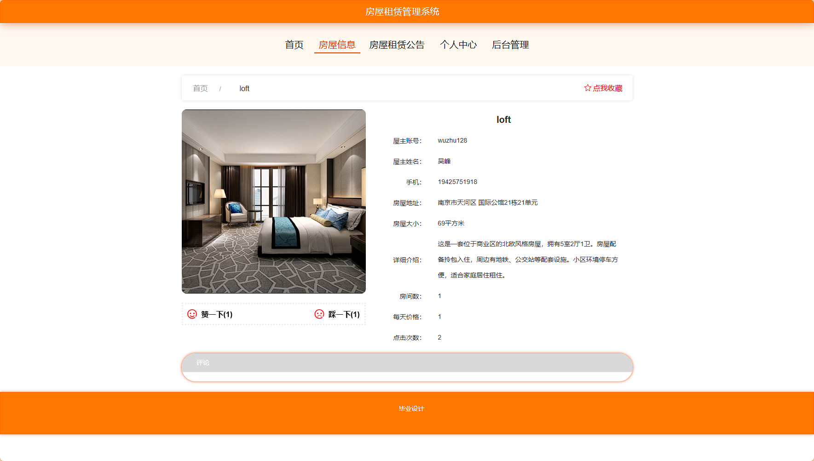

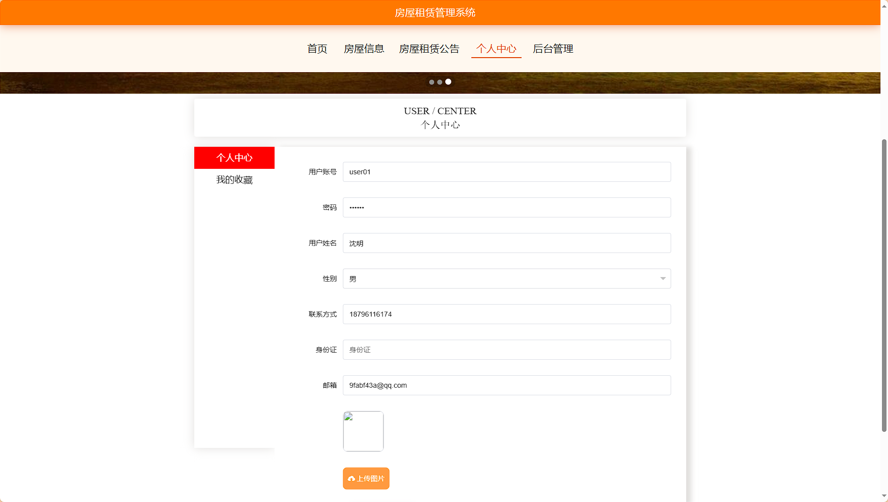

## 后台：
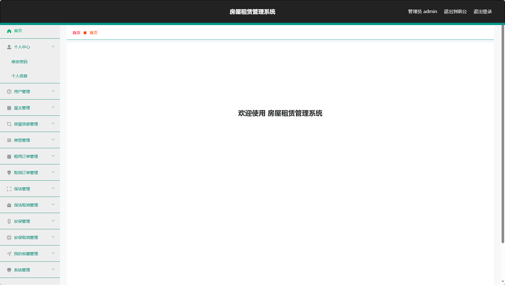
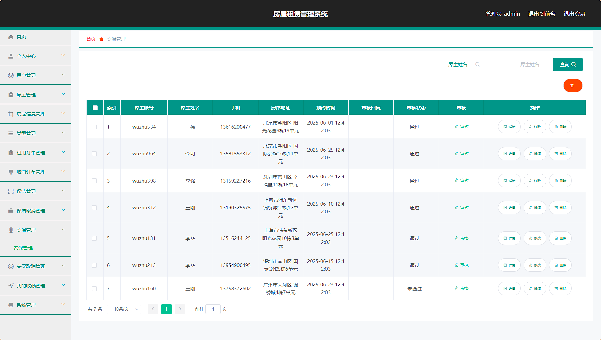
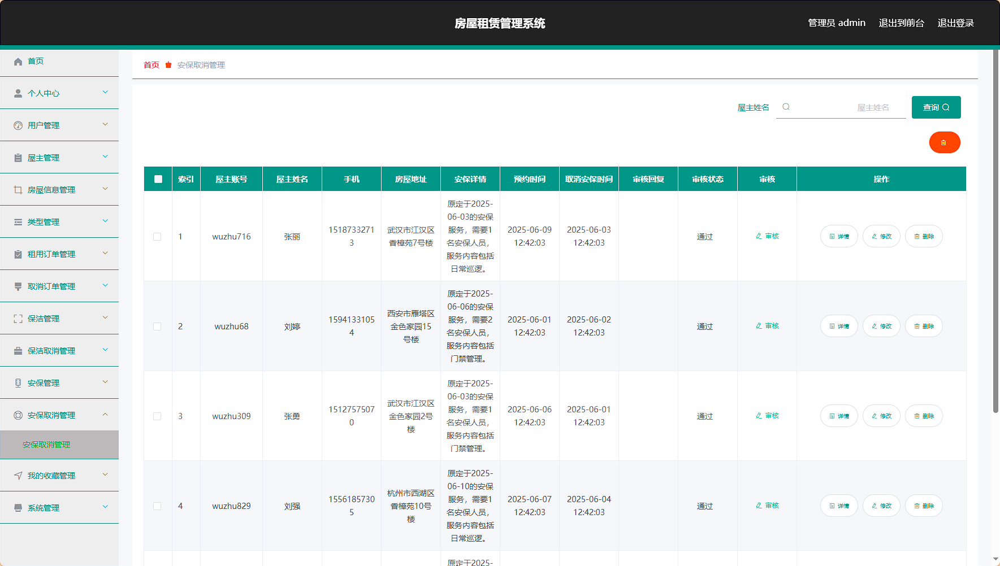
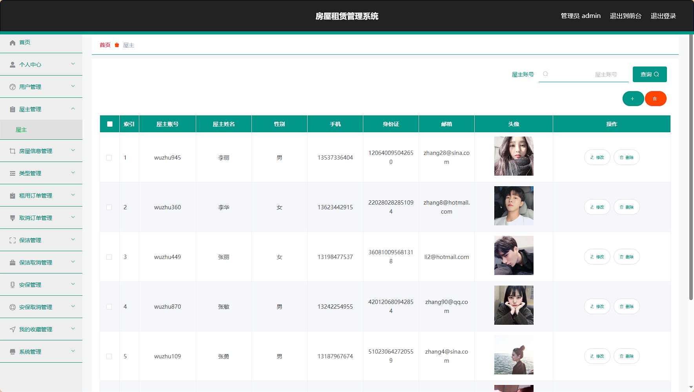
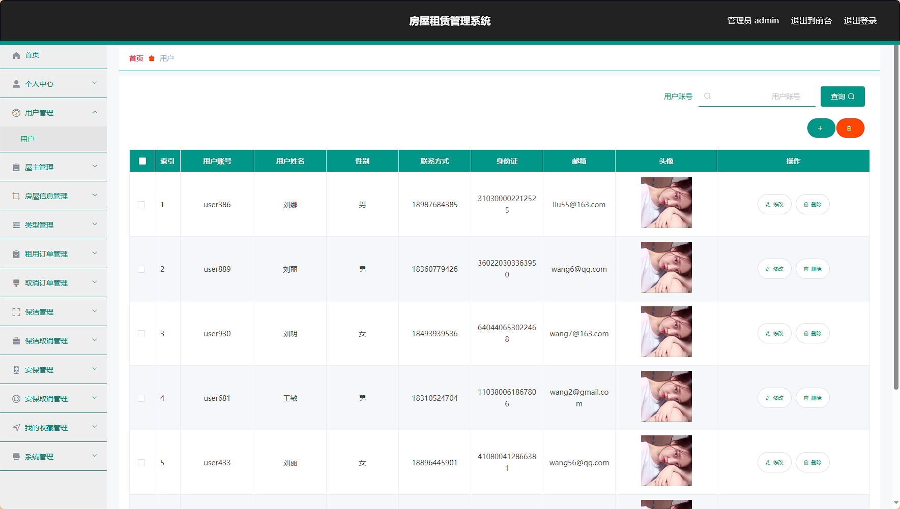
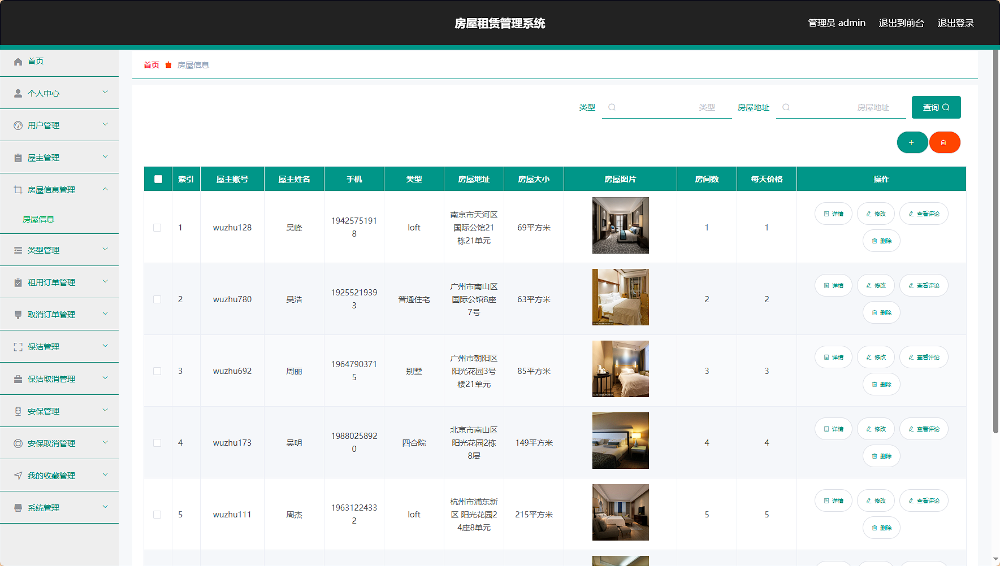
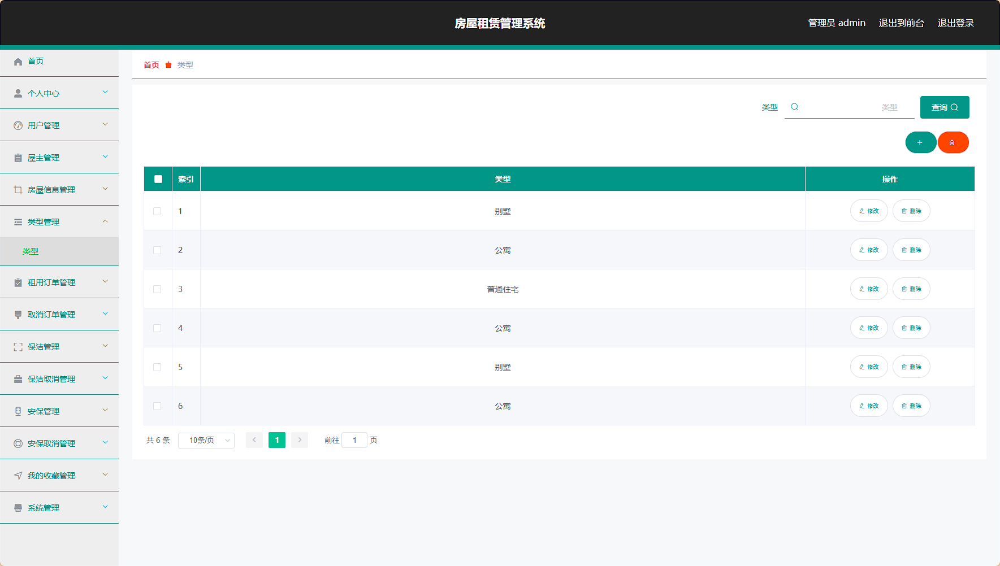
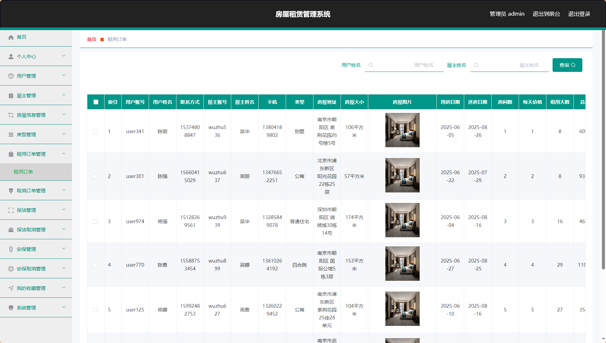
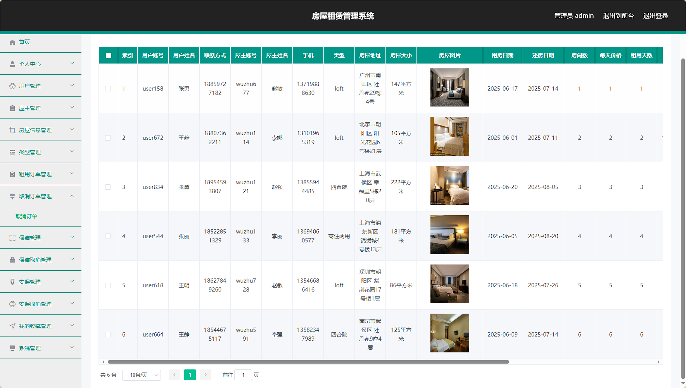
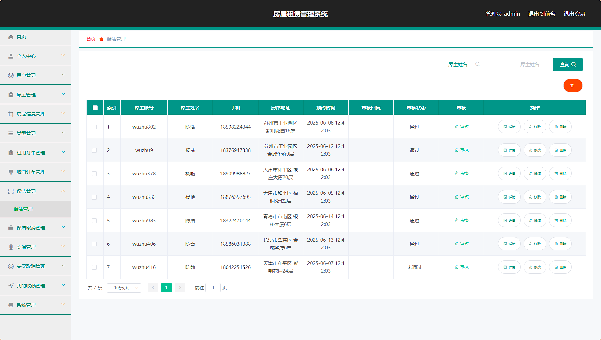
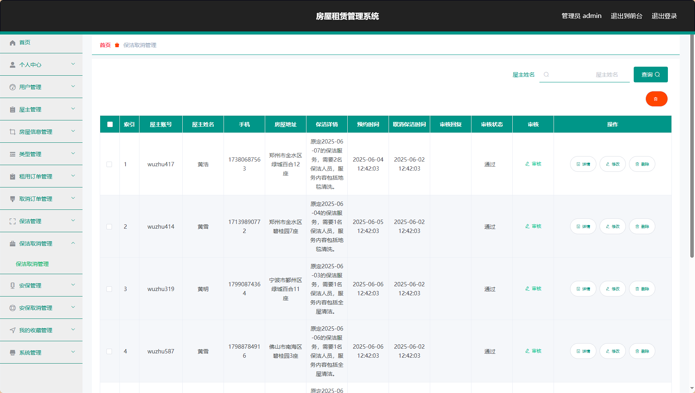

> 等等...

# 精选项目导航 & 快速部署工具
## 项目资源一站直达
- ​**访问项目导航站**：[点击进入](http://sysadmin.3vfree.vip)**快速检索所需项目名称**
- ​**技术栈全覆盖**：Java/SSm/Spring Boot/小程序等主流技术方案
- ​**配套资源**：每个项目均提供部署文档 + 演示视频（附效果截图）

### ▌导航站预览


### ▌工具界面预览


## 捐赠
> 博主将持续更新Java全栈开发项目，包含ssm，springboot，前后端分离系统等项目。
> 此外如果您够宽裕，请博主喝杯咖啡吧！捐赠将用于服务器维护与开源社区建设，感谢您的认可！
> 如需更多Java相关项目毕设3000+，有其他项目需求，sql文件等可联系博主v:xq-lucky311

---